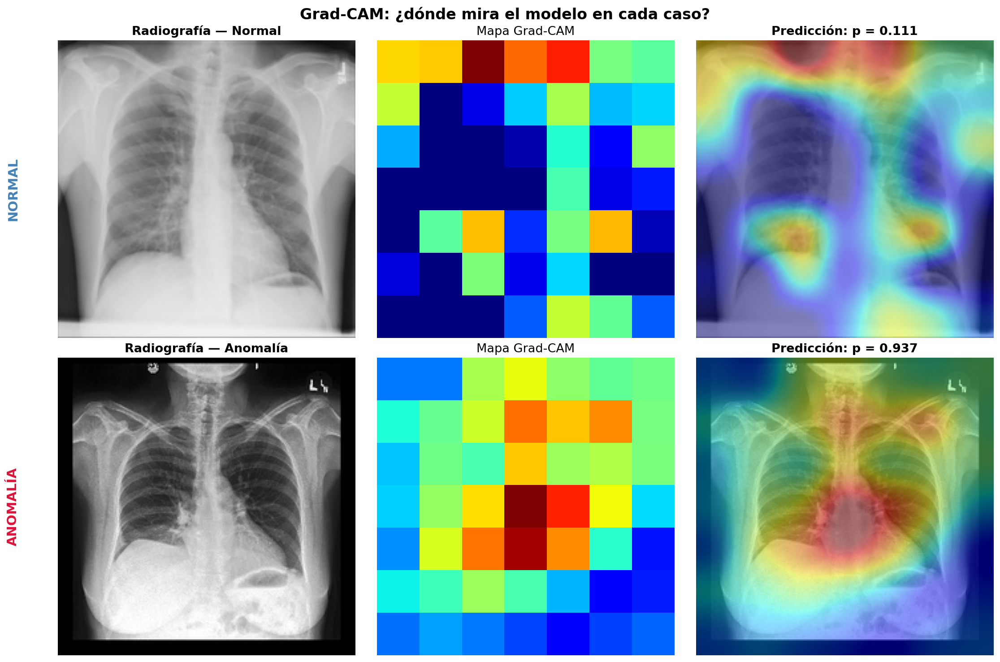
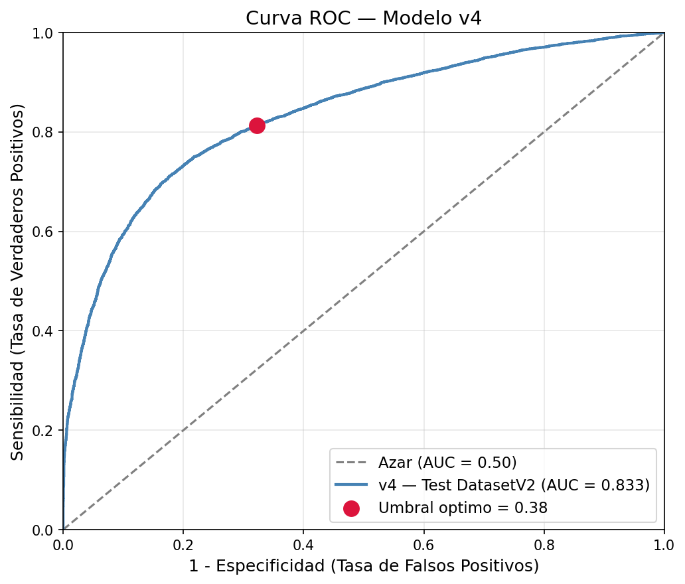
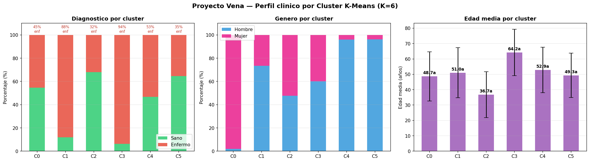
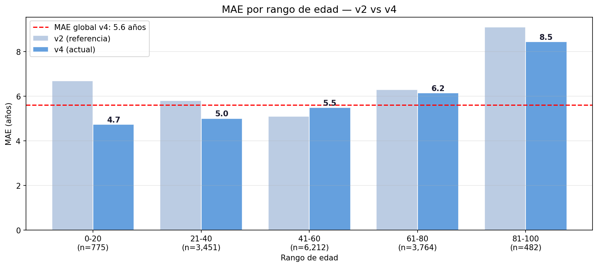
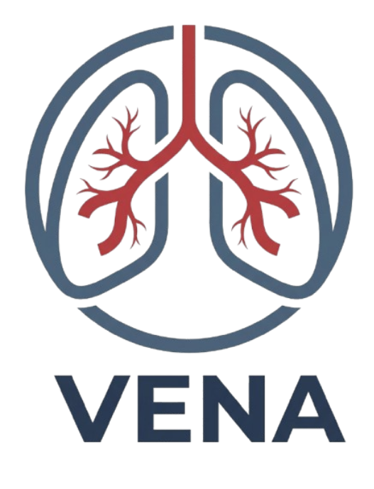

<div align="center">

# Vena
</div>

---
<div align="center">
  
## Vetted Extraction of Noteworthy Anomalies
</div>

Vena es un modelo de Inteligencia Artificial del sector medico encargado de analizar radiografias clinicas para detectar anomalias presentes dentro del torax humano. Este proyecto nacio dentro del programa "Samsung innovation Campus edicion 2025".   
Para desarrollarlo se conto con la colaboracion de:
- Olimpia de los Angeles Moctezuma Juan | [ivssun](https://github.com/ivssun)
- Marvin Antonio Martinez Martinez | [marvinmar3](https://github.com/marvinmar3)
- Diego Velazquez Sanchez | [itsSuwy](https://github.com/itsSuwy)
---

<div align="center">

### Muestra de funcionamiento

</div>

<div align="center">
  
    <div align="center" style="margin-bottom: 25px;">
      <br>Vista de como el modelo percibe una radiografia en busca de anomalias y como las refleja en un mapa de calor, evaluando los dos tipos de pacientes posibles:
    </div>
</div> 

---

## Funcionamiento
Vena cumple los siguientes puntos:
- Clasificar pacientes sanos de enfermos.
- Generar mapas de calor sobre las zonas en las cuales el modelo sospeche la presencia de Anomalias dentro del cuerpo humano.
- Encontrar grupos (clusters) de pacientes que cuenten con condiciones similares.
- Estimar la edad del usuario con solo ver su radiografia.
- Interpretar imagenes provenientes de datasets con los cuales **NO** fue entrenada, util para radiografias que provengan de diferentes hospitales = diferentes maquinas de radiografias.  

No obstante Vena tambien busca salirse de los entornos convencionales que dependen de Conda como gestor de paquetes y del propio entorno virtual, por ello se opto por utilizar UV como nucleo del proyecto, aprovechando su eficiencia, velocidad y organizacion para llevar a cabo su labor. Es por ello que dentro de la estructura del proyecto, existiran archivos nativos de este gestor, para facilitar la reproducibilidad del mismo proyecto, siendo los mas importantes `uv.lock` y `pyproject.toml`.

## Instalación 
### (Funcion parcialmente implementada - Leer el disclaimer)
### 1) Clonar el repositorio
```bash
$ git clone https://github.com/itsSuwy/vena-chest-xray-ai.git
```
### 2) Acceder al repositorio 
```bash
$ cd vena
```
### 3) Sincronizar la informacion de uv.lock
```bash
$ uv sync
```

<div align="center">  

### Algunas metricas obtenidas
</div>

<div align="center">
    
    <div align="center" style="margin-bottom: 25px;">
      <br>Curva ROC de la clasificación
    </div>
    
    <div align="center" style="margin-bottom: 25px;">
      <br>Características que definieron a cada cluster
    </div>
    
    <div align="center">
      <br>Métricas de MAE por rango de edad
    </div>
</div>

## Disclaimer  
Vena empezo siendo un proyecto individual de notebooks de ejecucion en google colab, dicha decision hizo que internamente la logica siga sujeta a variables del mismo google drive. No obstante Vena se encuentra en un proceso de transicion definitivo a repositorio personal para que su despliegue en local como en la nube resulte totalmente directo, logrando una reproducibilidad limpia con poca o nula intervencion externa.

<div align="center">

### Stack involved
</div>

<div align="center">
  
</div> 

<div align="center">
  
</div> 